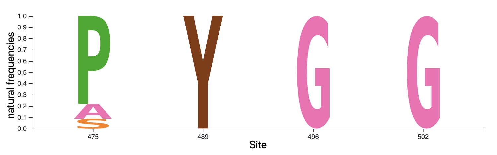
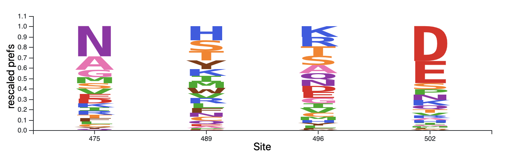

# `omegabysite` analysis

August 9, 2020

Most of this is taken from Tyler's slack posts but just reformatted slightly.
I've added some additional text to address some of Tyler's questions and/or concerns.

## goal

## data

The sequences and the preferences are described in [20200809_modelcomparison.md](20200809_modelcomparison.md).
In this summary, anything we describe as significant has a q-value of less than 0.05.

## results

Here are the sites with significant evidence they are evolving _slower_ than expected given the preferences.

model| list of sites
----|----
ExpCM_expr_gammaomega|335,389,395,408,475,489,496,502,518,522,524,527,531
ExpCM_expr|335,389,408,489,496,522,531
ExpCM_bind_gammaomega|335,389,395,405,408,411,463,466,517,518,521,522,523,524,531
ExpCM_bind|335,389,395,405,408,463,466,517,518,521,522,523,524,531

Here are possible hypotheses for _why_ some sites are evolving significantly slower in nature than in our experiment

### the expression condition does not capture binding constraint

Here we are looking at sites which we have evidence are evolving significantly slower with the expression data but not the binding data.

> 475,489,496,502,527

Four of these sites are ACE2 contacts (475, 489, 496, and 502) and this hypothesis of expression data missing binding constraint makes sense.
Here are some screenshots from `dms-view`.

Here are the natural frequencies at these four sites:

Here are the expression preferences

Here are the binding preferences:

We see that the expression preferences are quite tolerant, but the binding and the natural frequencies are constrained and seem to match up well.

But what about the other ACE2 contact sites, why didn't we catch them in this filter? They would be sites.
These would be sites
 >417,446,449,453,455,456,486,487,493,498,500,505.

We can look at them in `dms-view` and generally what we see is that they have very low omega values but just don't pass the cutoff.
The one exception is site 449 which actually have a very high omega, a low pvalue but a very high Q value.

### RBD only yeast display does not capture constraint from the full spike quaternary structure.

Tyler suggests that these would be sites which are near the bottom of the RBD (away from the ACE2 interface).
We would expect these to show up both expression sets.
I pulled out all sites which are in at least one expression model and at least one binding model.

> 335,389,395,408,518,522,524,531

It looks like all of these fall to the bottom except for 408.
As you would expect, all of the preferences are tolerant and the natural frequencies are 100% conserved.

### lipid binding pocket

Tyler said that the sites that structural papers say appear in the structural papers are
> 338,358,363,365,369,374,377,387,392,395,408,409,417,434,513

We pull out 395 and 408 in this set.
But overall it doesn't seem like `phydms` is really picking up on any of these sites.
These two sites are found in both sets.
This makes sense as this constraint would be absent from both of them.

### other observations

405,411,463,466,517,521,523 in the binding set but not the expression set.
It doesn't really make sense to me why something would be more constrained in expression than in the binding set as expression would be a pre-req to binding.

### go through each site

Here is the list of all sites we identified in any model
> 335,389,395,405,408,411,463,466,475,489,496,502,517,518,521,522,523,524,527,531

site|model|hypothesis|
---|---|---|
335|bind,bind+G,expr,expr+G|quat structure|
389|bind,bind+G,expr,expr+G|quat structure
395|bind,bind+G,expr|quat stucture or lipid|
405|bind,bind+G|?
408|bind,bind+G,expr,expr+G|lipid (not near bottom)
411|bind+G|?
463|bind,bind+G|?
466|bind,bind+G|?
475|expr+G|ACE2 contact
489|expr,expr+G|ACE2 contact
502|expr|ACE2 contact
517|bind,bind+G|?
518|bind,bind+G,expr|quat
521|bind,bind+G|?
522|bind,bind+G,expr,expr+G|quat structure
523|bind,bind+G|?
524|bind,bind+G,expr|quat structure
527|expr|? in the important for binding but not expression but not an ACE2 contact
531|bind,bind+G,expr,expr+G|quat structure

### thoughts on 463

Tyler pointed out site 463 as a site where the preferences are both tolerant but the natural frequencies are quite constrained.
They are getting an escape mutant at this site, but the `phydms` analysis might say that this is probably not a site that can handle a mutation.
I think this is a good case of how `phydms` could be used for some post-hoc analysis but is probably not a very good filter.
This site has a low omega and a low pvalue for binding but not for expression.
We wouldn't catch this site even if we used a pvalue cutoff instead of a Qvalue cutoff.
